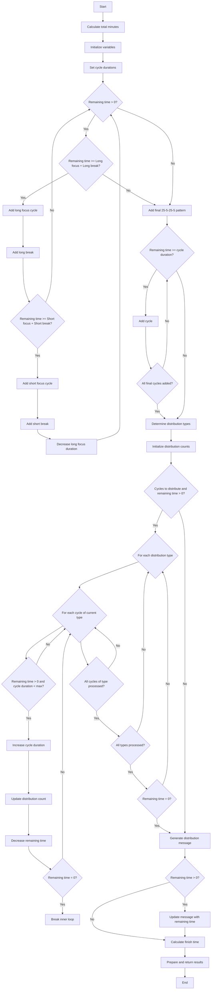

Algorithm i used to calculate time intervals for sessions using camel technique. this camel style focus intervals is used by twitch streamer https://www.twitch.tv/vanyastudytogether/

```mermaid
graph TD
    A[Start] --> B[Calculate total minutes]
    B --> C[Initialize variables]
    C --> D[Set cycle durations]
    D --> E{Remaining time > 0?}
    E -->|Yes| F{Remaining time >= Long focus + Long break?}
    F -->|Yes| G[Add long focus cycle]
    G --> H[Add long break]
    H --> I{Remaining time >= Short focus + Short break?}
    I -->|Yes| J[Add short focus cycle]
    J --> K[Add short break]
    K --> L[Decrease long focus duration]
    L --> E
    I -->|No| E
    F -->|No| M[Add final 25-5-25-5 pattern]
    E -->|No| M
    M --> N{Remaining time >= cycle duration?}
    N -->|Yes| O[Add cycle]
    O --> P{All final cycles added?}
    P -->|No| N
    P -->|Yes| Q[Determine distribution types]
    N -->|No| Q
    Q --> R[Initialize distribution counts]
    R --> S{Cycles to distribute and remaining time > 0?}
    S -->|Yes| T{For each distribution type}
    T --> U{For each cycle of current type}
    U --> V{Remaining time > 0 and cycle duration < max?}
    V -->|Yes| W[Increase cycle duration]
    W --> X[Update distribution count]
    X --> Y[Decrease remaining time]
    Y --> Z{Remaining time = 0?}
    Z -->|Yes| AA[Break inner loop]
    Z -->|No| U
    V -->|No| U
    U --> AB{All cycles of type processed?}
    AB -->|No| U
    AB -->|Yes| AC{All types processed?}
    AC -->|No| T
    AC -->|Yes| AD{Remaining time = 0?}
    AD -->|No| T
    AD -->|Yes| AE[Generate distribution message]
    S -->|No| AE
    AE --> AF{Remaining time > 0?}
    AF -->|Yes| AG[Update message with remaining time]
    AF -->|No| AH[Calculate finish time]
    AG --> AH
    AH --> AI[Prepare and return results]
    AI --> AJ[End]
```
